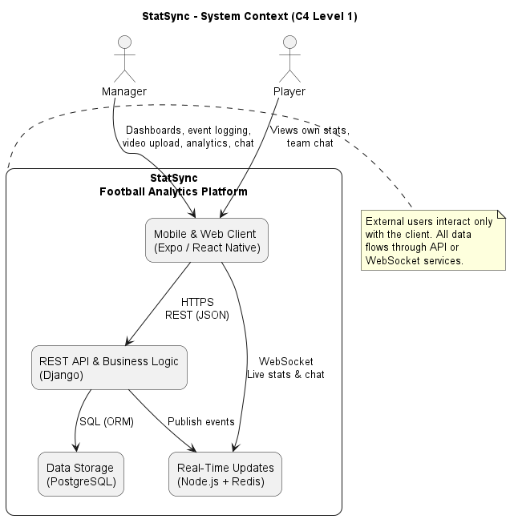
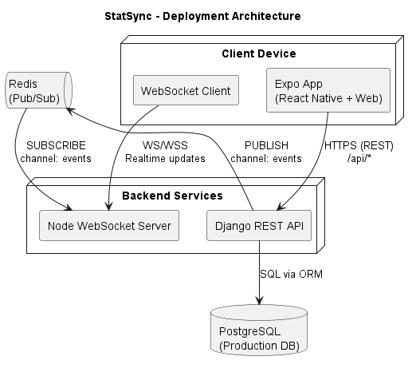
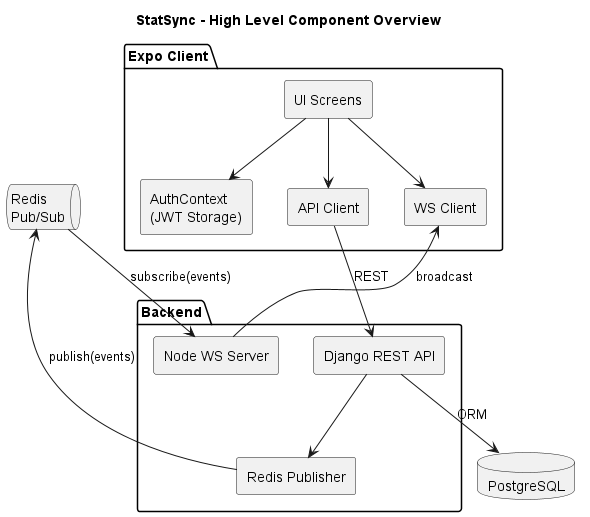
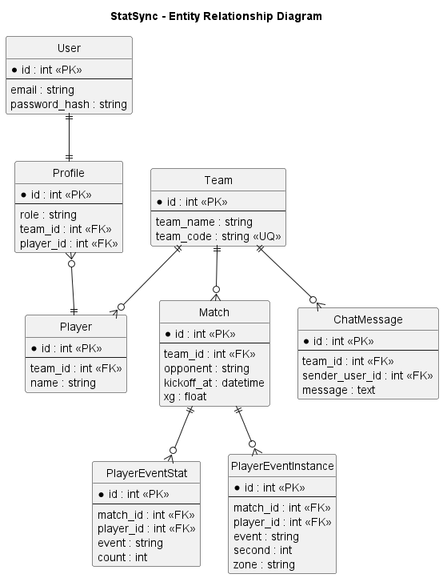
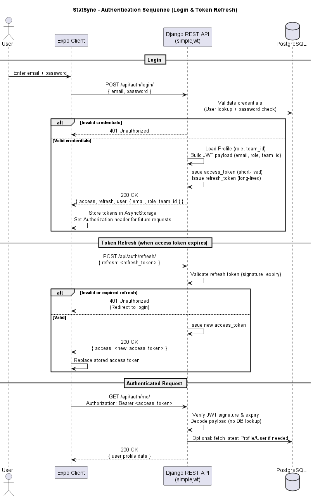
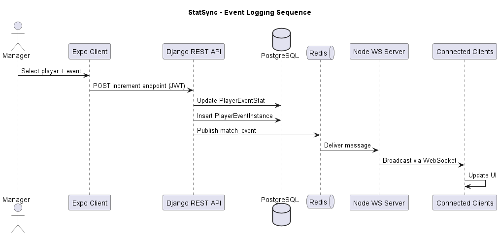
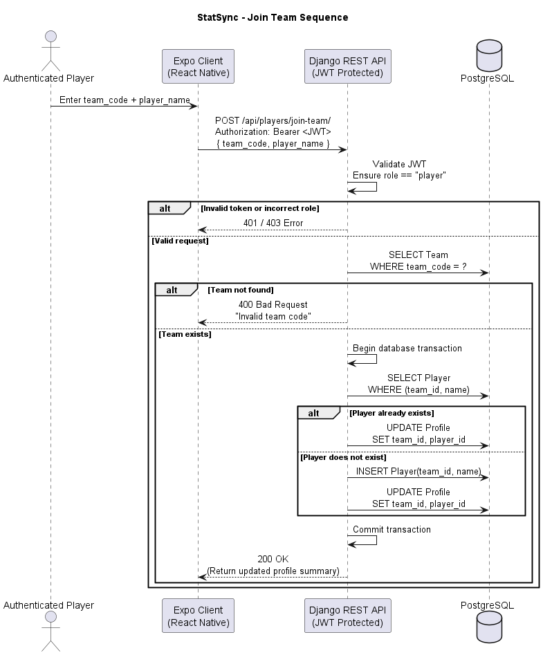
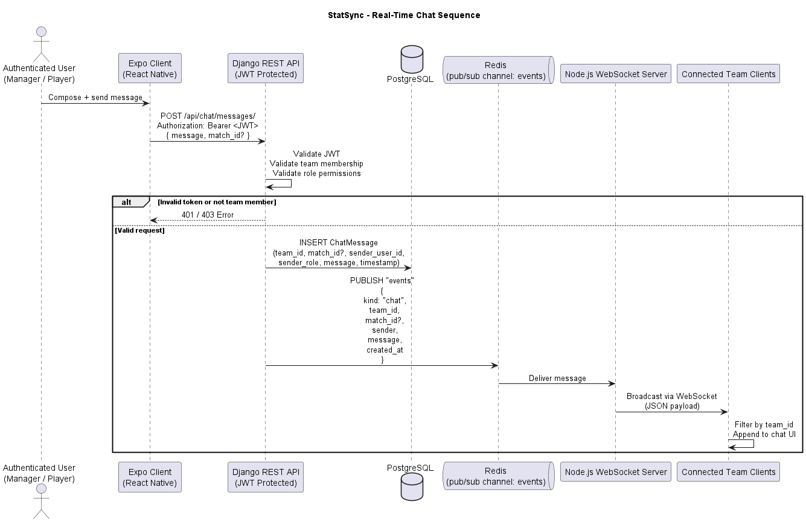
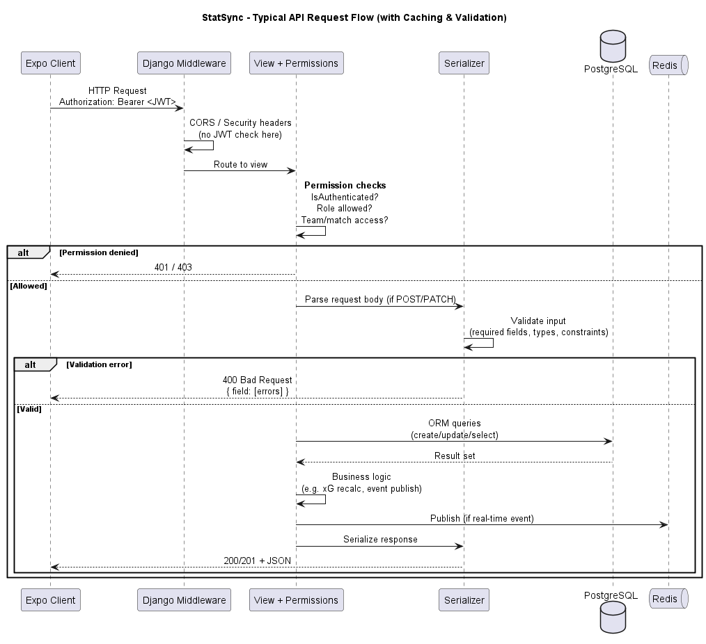
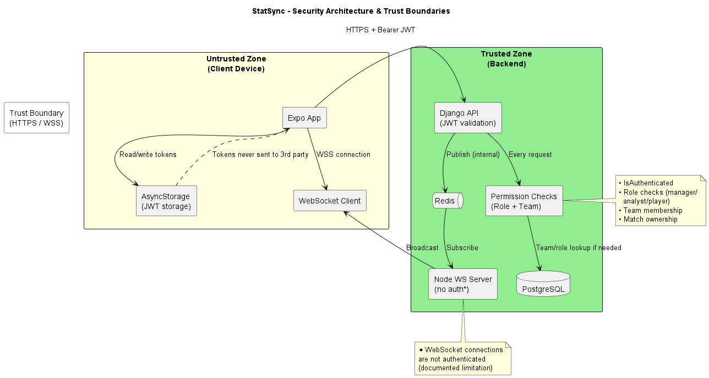

# StatSync – Technical Specification (Expanded)

**Author:** Darragh Gorman,  Hugh Quigley
**Programme:** BSc Computer Science  
**Module:** CSC1049 – Third Year Project  
**Academic Year:** 2025/2026  

---

---

# 1. Introduction

## 1.1 System Overview

StatSync is a distributed client–server football analytics platform designed to provide real-time match data capture, tactical analysis, and player performance tracking for grassroots and semi-professional teams.

The system enables structured event logging during live matches and provides analytical dashboards for post-match review. It integrates REST-based APIs, relational data modelling, real-time messaging infrastructure, and cloud deployment practices into a cohesive full-stack solution.

StatSync supports two user roles:

- **Manager** – Oversees squad management and match setup; records live match events, uploads match recordings, and uses team chat; views real-time dashboards and performance suggestions. The manager role combines oversight and hands-on event logging (no separate analyst role).
- **Player** – Joins a team via a generated team code and accesses personal statistics and team communication.

The system was developed over a six-month period and demonstrates practical application of:

- Backend API architecture and RESTful design  
- Role-based access control (RBAC)  
- Relational database design and dual event-storage strategy  
- Real-time distributed messaging (Redis pub/sub + WebSocket)  
- Stateless authentication (JWT)  
- Cloud-ready deployment (Railway, EAS, managed PostgreSQL/Redis)  

---

## 1.2 Project Objectives

The primary objectives of StatSync are:

1. **Real-time experience** – Deliver match updates without requiring client refresh, with WebSocket broadcast latency under 300 ms where possible.  
2. **Structured, scalable data** – Maintain match data in a normalised relational model with clear constraints and indexed access paths.  
3. **Strict access control** – Enforce role-based and team-scoped authorization at the API layer.  
4. **Cross-platform access** – Support mobile (iOS/Android) and web via a single Expo codebase.  
5. **Modular architecture** – Keep HTTP API, WebSocket delivery, and data persistence clearly separated for maintainability and scaling.  
6. **Production-ready deployment** – Demonstrate container-friendly, stateless services and managed database/Redis usage.  

These objectives align with the module’s emphasis on full-stack design, security, and professional deployment practices.

---

## 1.3 Scope

StatSync is scoped to grassroots and semi-professional football teams.

**In scope:**

- Internal generation and storage of all match data.  
- Real-time event logging and broadcast.  
- Team-level analytics, dashboards, and performance suggestions.  
- Video upload and timestamp-linked review.  
- Team chat and role-based access.  

**Out of scope:**

- Integration with external federation or league APIs.  
- Third-party sports data providers.  
- League-wide aggregation or multi-club comparisons.  
- Officially certified xG models (the system uses a heuristic xG model for demonstration).  

Spelling out what’s in and out of scope keeps the spec focused.

---

## 1.4 Non-Functional Requirements

### Performance

- Event logging (increment + persist + publish) must complete in under 200 ms under normal load.  
- WebSocket broadcast latency (Django → Redis → Node → client) should remain below 300 ms.  
- Dashboard and stats queries must complete within 500 ms (supported by aggregate tables and indexing).  

### Scalability

- Support multiple teams concurrently with isolated data via `team_id` and permissions.  
- Allow horizontal scaling of the WebSocket layer (multiple Node instances subscribing to the same Redis channel).  
- Ensure stateless backend services so that API and WebSocket servers can be replicated behind a load balancer.  

### Security

- JWT-based stateless authentication with short-lived access and long-lived refresh tokens.  
- Role-based and team-scoped authorization enforced at the view layer.  
- Sensitive configuration via environment variables; no secrets in version control.  
- Controlled media access (e.g. authenticated streaming with Range request support where implemented).  

### Availability

- REST API must function independently of real-time services; core CRUD remains available if Redis or the WebSocket server is down.  
- Real-time features must degrade gracefully (e.g. no crash if Redis is unavailable; optional fallback to polling on the client).  

### Maintainability

- Modular Django app structure (teams, matches, players, chat, auth).  
- Clear separation between HTTP (Django) and WebSocket (Node.js) services.  
- ORM-based database abstraction and migrations.  
- Version-controlled infrastructure and configuration (e.g. deployment docs, env templates).  

---

# 2. System Architecture

## 2.1 Architectural Overview

StatSync follows a three-tier architecture with a separate real-time path:

| Layer | Technology | Responsibility |
|-------|------------|----------------|
| **Presentation** | Expo (React Native + Web) | UI rendering, navigation, JWT storage (AsyncStorage), REST and WebSocket clients |
| **Application** | Django REST Framework | Business logic, authentication, authorization, persistence, event publishing, xG calculation |
| **Data** | PostgreSQL | Persistent relational storage, referential integrity, indexed queries |

**Real-time path:**

- **Redis** – Pub/sub messaging between Django and the WebSocket server.  
- **Node.js WebSocket server** – Subscribes to Redis channels and broadcasts to connected clients.  

This design promotes separation of concerns: HTTP API and WebSocket delivery can be scaled, deployed, and failed independently.

---

## 2.2 System Context

The following diagram shows the system boundary and external actors.

*Source: `diagrams/context_diagram.puml`*

- Managers use the Expo client for dashboards, event logging, video upload, and chat; Players use it for personal stats and team chat.  
- All server-side interaction is via the REST API or WebSocket; the client never talks directly to PostgreSQL or Redis.
 

---

## 2.3 Deployment Architecture

*Source: `diagrams/deployment_architecture.puml`*

### 2.3.1 Architecture Flow

1. The Expo client sends HTTPS REST requests to Django (e.g. `/api/*`).  
2. Django interacts with PostgreSQL via the ORM (queries, transactions).  
3. When real-time events occur (e.g. event increment, chat message), Django publishes messages to Redis (e.g. channel `events`).  
4. The Node.js WebSocket server subscribes to the same Redis channel.  
5. Connected clients receive WebSocket broadcasts (JSON payloads) and update the UI in real time.  

### 2.3.2 Design Rationale

- **Two separate services (Django and Node)** – Django focuses on CRUD, auth, and business rules; Node focuses only on fan-out to WebSocket clients. This avoids mixing ASGI/Channels with Django and simplifies deployment (e.g. separate containers or processes).  
- **Redis as message broker** – Decouples producer (Django) from consumer (Node); multiple Node instances can subscribe to the same channel for horizontal scaling.  
- **Stateless API** – No server-side session store; JWT enables any API replica to validate requests.  

---

## 2.4 Component Overview

*Source: `diagrams/component_overview.puml`*

### 2.4.1 Expo Client

- **UI screens** – Role-specific screens (manager dashboard and event logger, player stats).  
- **AuthContext** – Holds JWT (access/refresh), login/logout, token refresh logic; tokens stored in AsyncStorage.  
- **API client** – HTTP client with base URL and `Authorization: Bearer <token>`; handles 401 and refresh flow.  
- **WebSocket client** – Connects to Node server; subscribes to relevant channels/context (e.g. team or match); updates local state on message receipt.  

### 2.4.2 Django Backend

- **REST API** – Views, serializers, permissions; CRUD for teams, matches, players, events, chat.  
- **Redis publisher** – After state-changing operations (e.g. event increment, chat send), publishes JSON to Redis so Node can broadcast.  
- **Business logic** – xG recalculation, match state transitions, validation, and constraints.  

### 2.4.3 Node.js WebSocket Server

- Subscribes to Redis channel (e.g. `events`, `chat`).  
- On message receipt, broadcasts to all connected WebSocket clients.  
- Stateless; can run multiple instances behind a load balancer with sticky sessions or a shared Redis.  

### 2.4.4 Data and Messaging

- **PostgreSQL** – Single source of truth for users, profiles, teams, matches, events, chat messages.  
- **Redis** – No persistent storage; used only for pub/sub.

---

# 3. Data Model Design

## 3.1 Entity Relationship Diagram

*Source: `diagrams/erd.puml`*

### 3.1.1 Core Entities

| Entity | Purpose |
|--------|---------|
| **User** | Django auth user (email, password hash); 1:1 with Profile. |
| **Profile** | Role (manager or player), `team_id`, optional `player_id`; extends User for app-specific data. Manager covers event logging and analytics; player is team member viewing own stats. |
| **Team** | Team name, unique `team_code` (e.g. 8-character) for join flow. |
| **Player** | Belongs to one Team; name; unique per team (e.g. `(team_id, name)`). |
| **Match** | Belongs to Team; opponent, kickoff time, state, elapsed_seconds, xG fields. |
| **PlayerEventStat** | Aggregate count per (match, player, event type); used for dashboards. |
| **PlayerEventInstance** | Single occurrence: match, player, event type, second, zone; used for timeline and xG. |
| **ChatMessage** | team_id, sender_user_id, message, optional match_id; persisted then published. |
| **MatchRecording** | Links match to stored video (path or URL). |

### 3.1.2 Relationship Summary

- User ↔ Profile: **1:1**.  
- Team → Player: **1:M**.  
- Team → Match: **1:M**.  
- Match → PlayerEventStat: **1:M**.  
- Match → PlayerEventInstance: **1:M**.  
- Team → ChatMessage: **1:M**.  
- Profile → Player: **0..1** (only for role=player).  

---

## 3.2 Dual Event Storage Strategy

StatSync uses a hybrid event storage model to satisfy both fast aggregations and detailed analysis.

### 3.2.1 PlayerEventStat (Aggregates)

- Stores per-player, per-match, per-event-type counts.  
- **Purpose:** Optimised for dashboard queries (e.g. “shots on target for player X in match Y”).  
- Reduces repeated `COUNT(*)` over raw event rows and keeps response times within NFR targets.  

### 3.2.2 PlayerEventInstance (Raw Events)

- Stores each occurrence with timestamp (second), zone, and event type.  
- **Purpose:** Timeline visualisation, tactical zone analysis, xG computation, and “jump to moment” in video.  
- Enables richer analytics without slowing down simple stat displays.  

### 3.2.3 Trade-off

- **Write path:** Each logged event updates one row in `PlayerEventStat` and inserts one row in `PlayerEventInstance`.  
- **Read path:** Dashboards read from `PlayerEventStat`; timeline and xG read from `PlayerEventInstance`.  
- This balances query performance with analytical flexibility and is a documented design decision in the “Design Challenges” section.  

---

## 3.3 Data Integrity Constraints

- **Player:** Unique `(team_id, name)` (case-normalised where applied).  
- **Team:** Unique `team_code`.  
- **PlayerEventStat:** Uniqueness on `(match_id, player_id, event)` so one row per (match, player, event type).  
- **Foreign keys** – All relationships enforced by FKs; cascades defined as appropriate (e.g. on delete of Team).  
- **Profile** – Links to at most one Player; team and player consistency maintained in join/leave logic.  

---

# 4. Core System Workflows

## 4.1 Authentication & Authorisation

Authentication uses JSON Web Tokens (JWT) with short-lived access and long-lived refresh tokens.

### 4.1.1 Authentication Sequence

*Source: `diagrams/auth_sequence.puml`*

- **Login:** Client sends credentials; Django validates against User and issues access + refresh tokens; client stores them (e.g. AsyncStorage) and attaches access token to subsequent requests.  
- **Refresh:** When access token expires, client sends refresh token; Django returns a new access token.  
- **Authenticated request:** Client sends `Authorization: Bearer <access_token>`; Django verifies signature and expiry (and optionally loads profile).  

### 4.1.2 Token Payload

- Typically includes: `email`, `role`, `team_id` (and standard JWT claims).  
- Authorization is enforced at the view layer via permission classes and role/team checks (see Security section).  

---

## 4.2 Match Event Logging

*Source: `diagrams/event_logging_sequence.puml`*

### 4.2.1 Workflow (Step-by-Step)

1. Manager selects player and event type in the client.  
2. Client sends **POST** to increment endpoint (e.g. `/api/matches/{id}/{event}/{player}/increment/`) with JWT.  
3. Django validates JWT, permissions (manager), and match access.  
4. **PlayerEventStat** – Increment or create row for (match, player, event).  
5. **PlayerEventInstance** – Insert row with second, zone, event type.  
6. **xG** – Recalculated where the event is shot-related.  
7. Django publishes a message to Redis (e.g. channel `events`, kind `stat`).  
8. Node server receives from Redis and broadcasts via WebSocket.  
9. All connected clients (e.g. manager dashboard) update UI in real time.  

This end-to-end flow is the core of the “real-time match updates” requirement.

---

## 4.3 Team Management

### 4.3.1 Join Team

*Source: `diagrams/join_team_sequence.puml`*

- Player enters 6-character team code and player name.  
- Client sends **POST** to `/api/players/join-team/` with JWT (role must be player).  
- Backend validates team existence by `team_code`.  
- In a transaction: if a `Player` with (team_id, name) exists, link Profile to that Player; otherwise create Player then link Profile.  
- Ensures one Profile per User and consistent Profile–Player–Team relationship.  

### 4.3.2 Leave Team

- Profile is unlinked from team; associated Player row may be removed or retained per business rule.  
- Database consistency between Profile and Player is maintained in the same service layer.  

---

## 4.4 Real-Time Messaging (Chat)

*Source: `diagrams/realtime_chat_sequence.puml`*

- User composes and sends a message from the client.  
- Client **POST** to chat endpoint with JWT; Django validates team membership and role.  
- Message is inserted into `ChatMessage` (PostgreSQL).  
- Django publishes to Redis (e.g. channel `events`, kind `chat`) with team_id and payload.  
- Node server broadcasts to WebSocket clients; clients filter by team_id so only relevant users see the message.  

Chat is both persisted (for history) and delivered in real time (for live collaboration).

---

## 4.5 API Request Flow (Generic)

*Source: `diagrams/api_request_flow.puml`*

A typical authenticated request passes through:

1. **Middleware** – CORS, security headers (JWT not validated here).  
2. **View + permissions** – IsAuthenticated, role, team/match access.  
3. **Serializer** – Input validation (required fields, types).  
4. **ORM** – Read/write to PostgreSQL; optional publish to Redis.  
5. **Response** – Serialized JSON and appropriate HTTP status.  

This flow is consistent across match, team, player, and chat endpoints and supports the NFRs for security and maintainability.

---

# 5. Security Design

## 5.1 Security Architecture Diagram

*Source: `diagrams/security_architecture.puml`*

### 5.1.1 Trust Boundaries

- **Untrusted zone** – Client device (Expo app, AsyncStorage, WebSocket client). Tokens are stored on device; no direct access to database or Redis.  
- **Trust boundary** – HTTPS and WSS; all server communication over TLS in production.  
- **Trusted zone** – Django (validates JWT and enforces permissions), Node (broadcasts only), PostgreSQL, Redis.  

### 5.1.2 Measures

- **Stateless JWT authentication** – No server-side session store; access and refresh tokens as described in 4.1.  
- **Role-based permission enforcement** – Every protected endpoint checks role and (where relevant) team_id and match ownership.  
- **Environment-based configuration** – Secrets (DB, Redis, JWT keys) via environment variables.  
- **Controlled media access** – Streaming and downloads (where implemented) are authenticated and scoped (e.g. by team/match).  
- **Minimal CSRF exemptions** – API is token-based; CSRF exemptions limited to necessary endpoints.  

### 5.1.3 Documented Limitation

- **WebSocket connections are not authenticated** in the current design. The Node server accepts connections and broadcasts to all subscribers; team filtering is done on the client. WebSocket-level auth (e.g. token in connection URL or first message) is left as future work.  

---

# 6. Performance & Scalability

- **Indexed foreign keys** – All FKs indexed to keep join performance predictable.  
- **Aggregate table (PlayerEventStat)** – Reduces COUNT overhead for dashboard queries.  
- **Redis pub/sub** – Low-latency, in-memory distribution of events.  
- **Horizontal scaling** – WebSocket server can run multiple instances; Redis is the single fan-out point.  
- **Stateless backend** – Django and Node can be replicated; no sticky session requirement for API.  
- **NFR targets** – 200 ms event logging, 300 ms WebSocket latency, 500 ms dashboard queries are met through the above choices.  

---

# 7. API Design

All REST endpoints are prefixed with `/api/`. Responses use standard HTTP status codes (200, 201, 400, 401, 403, 404).

### Authentication

- `POST /api/auth/login/` – Credentials → access + refresh tokens.  
- `POST /api/auth/refresh/` – Refresh token → new access token.  
- `GET /api/auth/me/` – Current user/profile (requires valid JWT).  

### Team Management

- `POST /api/players/join-team/` – Join team by team code (player role).  
- `POST /api/players/leave-team/` – Leave current team.  
- `GET /api/teams/me/` – Current user’s team info.  

### Match Operations

- `POST /api/matches/` – Create match.  
- `PATCH /api/matches/{id}/` – Update match.  
- `POST /api/matches/{id}/{event}/{player}/increment/` – Increment event (and create instance).  
- `GET /api/matches/{id}/stats/` – Match stats (aggregates and/or instances as needed).  

Additional endpoints (e.g. chat, video upload, timer, performance suggestions) follow the same conventions and are documented in the codebase and deployment/architecture docs.

---

# 8. Design Challenges & Technical Decisions

### 8.1 Database Choice

- MongoDB was initially considered; PostgreSQL was chosen for stronger relational modelling, ACID transactions, and Django migration tooling. The dual event model (aggregate + instances) fits a relational schema and benefits from FKs and indexes.  

### 8.2 Real-Time Architecture

- Django Channels was considered; the solution uses Redis pub/sub + Node.js WebSocket server to avoid ASGI complexity and to keep a single responsibility per process (Django = API, Node = broadcast). This improves deployability and scaling.  

### 8.3 Redirect Loop (Join Team)

- During join-team flow, auth refetch logic caused repeated redirects; the flow was refined (e.g. when to refetch profile, when to redirect) to eliminate the loop while keeping UX correct.  

### 8.4 Event Storage

- A single-table event design led to heavy COUNT queries for dashboards. The dual storage approach (PlayerEventStat + PlayerEventInstance) was adopted to optimise both dashboard latency and timeline/xG use cases.  

---

# 9. Testing

We did a small amount of automated testing on the backend and had the app tried by someone who works with match video in practice.

## 9.1 Automated Testing (Backend)

We added a limited set of tests under `backend/stato/tests/` using Django’s `TestCase` and `APITestCase`, focusing on key areas only. We did not test everything rigorously.

- **Unit tests** – A few tests for models (e.g. team code generation, unique player per team) and for helper functions (e.g. `_get_team`, `_parse_kickoff`). A small number of serializer and permission checks.
- **Integration tests** – Tests for the main API flows: login and `/auth/me/`, join-team (valid and invalid code), match list and timer. Enough to check that these paths work and return the expected status codes.

Tests are run with `python manage.py test stato.tests` and use an in-memory SQLite database; no Redis or WebSocket server is required. We did not add frontend, WebSocket, or chat API tests. In total there are **28 tests** across the backend test files.

**What we found:** The tests highlighted that invalid team code was returning 400 instead of 404; we fixed that so the frontend could show a clear error. Beyond that, the tests give us a basic check that the critical flows (login, join team, match list, timer) still work after changes.

## 9.2 User Testing (In the Field)

We had the app tested by someone who works in football and regularly reviews match video (a coach who does part-time opposition analysis). They used the match review and video playback over a couple of sessions and gave us direct feedback.

Their main suggestion was to make it easier to jump to specific moments in the recording when reviewing a match. They wanted to filter the event timeline by **player** and by **action type** (e.g. shots, key passes) and then jump from the list straight to that moment in the video, instead of scrubbing through the whole match. We implemented that: on the match review screen you can filter events by player and by event type, and each event in the list links to its timestamp so the video seeks to that point. That change came directly from their feedback and made the review workflow much more usable for post-match analysis.

---

# 10. Deployment

## Backend (Django)

- Deployed on Railway.  
- **PostgreSQL** – Managed service.  
- **Redis** – Managed service for pub/sub.  
- **Gunicorn** (or similar) as production WSGI server.  

## WebSocket Server (Node.js)

- Deployed as a separate service
- Connected to the same Redis instance as Django for channel subscription.  

## Frontend (Expo)

- Built with Expo EAS.  
- Production API base URL and WebSocket URL set via environment variables.  
- No hardcoded dev URLs in production builds.  

---

# 11. Limitations

- WebSocket connections are not authenticated (see 5.1.3).  
- xG model is heuristic-based, not trained on professional data.  
- Redis is single-instance (no clustering).  
- No third-party data integration (league/federation APIs).  

---

# 12. Future Work

- Machine learning–based xG modelling.  
- Tactical heatmap visualisations.  
- Match comparison engine.  
- WebSocket authentication layer.  
- Cloud object storage for recordings.  
- Analytics export (PDF/CSV).  

---

# 13. Conclusion

StatSync is a full-stack, real-time football analytics system developed over six months. The architecture is modular and keeps the REST API, real-time delivery, and data storage clearly separated. The diagrams in this document (context, deployment, components, ERD, sequences, security, API flow) cover different levels of detail so that both high-level and implementation views are documented. The system meets the stated functional and non-functional requirements and leaves room for the enhancements listed in §12.
